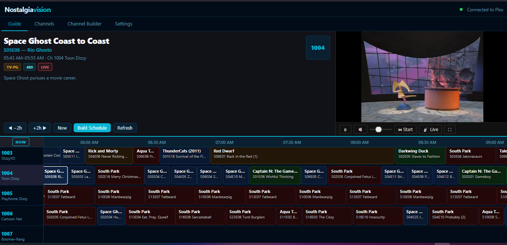

# NostalgiaVision

A self-hosted, retro TV experience powered by your Plex media server. NostalgiaVision turns your personal media library into a live TV broadcast — complete with a scrollable program guide, channel surfing, live preview, and automatic scheduling.



## What it does

NostalgiaVision generates a rolling multi-day TV schedule from your Plex library and presents it as a classic electronic program guide (EPG). Content plays back through your browser as a live stream, advancing automatically from one program to the next — no clicking required.

- Browse the guide grid, click a program, and watch it from the live position
- Leave it running and it behaves like a real TV channel — programs roll over automatically
- Color-coded program blocks by content rating (G, PG, TV-14, TV-MA, NR)
- Retro "We'll Be Right Back" overlay during genuine schedule gaps
- Six UI themes selectable from Settings

---

## Quick start

```bash
# Install dependencies
pip install -r requirements.txt

# Create your config from the example
cp config.example.json config.json
# Edit config.json and add your Plex URL and token

# Launch
python start.py
```

Then open **http://localhost:5000** — the browser opens automatically.

---

## First-time setup

1. **Settings → Plex Connection** — enter your Plex server URL (e.g. `http://192.168.1.100:32400`) and your [Plex token](https://support.plex.tv/articles/204059436-finding-an-authentication-token-x-plex-token/).
2. **Settings → Library Sync** — select your TV/movie libraries and click **Sync Selected**. This caches your library locally in SQLite.
3. **Settings → Build Schedule Now** — generates a rolling schedule for all channels.
4. Switch to the **Guide** tab to start watching.

> Re-run **Build Schedule Now** after every sync to pick up new content.

---

## Features

### Program guide
- Scrollable EPG grid with current and upcoming programs per channel
- Program blocks color-coded by content rating
- Live "now playing" indicator with progress bar on the current program
- Keyboard navigation — arrow keys move between channels and programs (useful for remote controls)

### Playback
- HLS live stream via your Plex server, seeking to the current position automatically
- Auto-advances to the next program when the current one ends
- "We'll Be Right Back" overlay for genuine gaps between scheduled programs
- Volume, mute, seek-to-live, fullscreen, and play-from-start controls

### Channels
- 72 predefined channels — content matched from your library by genre, network, keyword, rating, or collection
- Custom channel builder — filter by any combination of those criteria
- Show/hide individual channels to keep the guide clean
- Per-channel logo upload

### Scheduling
- 4 algorithms: **Random**, **Cyclic Shuffle** (by season), **Block Shuffle**, **Block Cyclic**
- Back-to-back scheduling — no artificial padding or gaps between episodes
- Schedule rebuilds cleanly after a library sync (stale programs are replaced)
- 3-day rolling window (configurable)

### Appearance
- Six built-in themes: Midnight, CRT Green, Amber, Ocean, Rose, Mono
- Theme persists across sessions via localStorage

---

## Project structure

```
nostalgiavision/
├── app.py           # Flask web server + REST API
├── channels.py      # 72 predefined channel configs
├── scheduler.py     # Schedule generation (4 algorithms)
├── library_sync.py  # Plex → SQLite content sync
├── plex_client.py   # Plex HTTP API wrapper
├── database.py      # SQLite layer (content cache + EPG)
├── start.py         # Entry point
├── config.json      # Runtime config (Plex URL, token, etc.)
├── data/            # SQLite database (auto-created)
├── image/           # Static assets (logos, screenshots)
└── templates/
    └── index.html   # Single-page web UI
```

---

## Configuration

`config.json` is required — copy `config.example.json`, fill in your Plex URL and token, and the app will use it on every start. Available options:

```json
{
  "plex_url": "http://192.168.1.100:32400",
  "plex_token": "your-token-here",
  "library_ids": ["1", "2"],
  "schedule_days_ahead": 3,
  "port": 5000,
  "host": "0.0.0.0"
}
```

| Key | Default | Description |
|-----|---------|-------------|
| `plex_url` | — | Base URL of your Plex Media Server |
| `plex_token` | — | Plex authentication token |
| `library_ids` | `[]` | Library section IDs to sync (found in Settings → Libraries) |
| `schedule_days_ahead` | `3` | How many days of schedule to generate |
| `port` | `5000` | Port the web UI listens on |
| `host` | `0.0.0.0` | Bind address (`0.0.0.0` = accessible on the network) |

---

## Finding your Plex token

1. Sign in to Plex Web
2. Open any media item → ⋮ menu → **Get Info** → **View XML**
3. Copy the `X-Plex-Token` value from the URL bar

Or follow the official guide: https://support.plex.tv/articles/204059436-finding-an-authentication-token-x-plex-token/

---

## Channel matching

Each predefined channel filters your library using one or more of:

| Filter | Example |
|--------|---------|
| Genre | `Animation`, `Horror`, `Documentary` |
| Network / Studio | `HBO`, `Disney`, `Cartoon Network` |
| Keyword | Matched against title and show title |
| Content rating | `TV-PG`, `TV-MA`, `PG-13` |
| Collection | Plex collection names |

Channels with no matching content show nothing in the guide — use **Hide** on the Channels tab to remove them from view.
